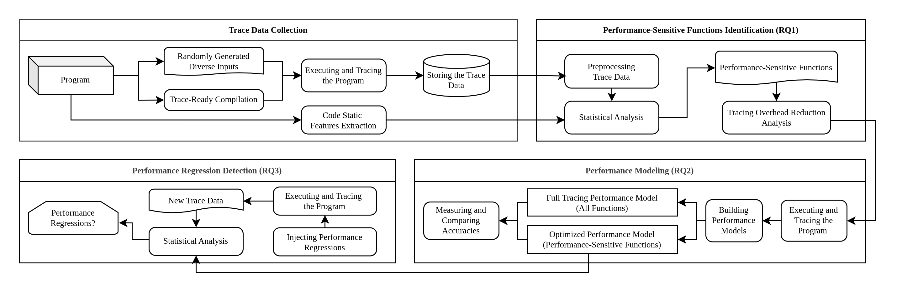

# Replication Package - Tracing Optimization for Performance Modeling and Regression Detection

**Description**: This repository contains the replication package for the paper "Tracing Optimization for Performance Modeling and Regression Detection".

## Introduction
The overall overview of the methodology is illustrated in the following figure:


### Application Scenario
Our approach primarily focuses on performance modeling and regression detection within continuous integration or production environments. In continuous integration settings, full tracing with higher overhead occurs less frequently (i.e., for proposed dynamic approaches), typically once for each release, to identify performance-sensitive functions. In contrast to dynamic approaches, the static method can be used without introducing any extra overhead (i.e., skipping the previous step). Followingly, after determining performance-sensitive functions through either dynamic or static approaches, optimized tracing with lower overhead is performed more frequently, often for each commit, to construct performance models and detect regressions. The optimized tracing can be applied in production settings to identify regressions under real-world field workloads due to its minimal overhead.

## Methodology
This section provides a brief overview of the methodology. For more details, please refer to the paper.

- **Step 1: Trace Data Collection**: We collect full tracing data for each program execution to identify performance-sensitive functions.

- **Step 2a: Performance-Sensitive Identification**: Leveraging the full tracing data, we identify performance-sensitive functions. we employ four primary dynamic approaches for pruning program functions for tracing and a static one.For dynamic approaches, we determine a function *performance-insensitive* and mark it eligible for removal from tracing if: (1) it consistently performs similarly across different inputs, or (2) it contributes insignificantly to the performance model. For the first aspect, we employ *Shannon's Entropy* and *Coefficient of Variation* metrics. Regarding the second aspect, we analyze the *correlation* among function performance metrics and each function's *feature significance* in a linear regression-based model. We also consider the combinations of these metrics. In addition, for the static approach, we compute multiple performance-related static code features for each function and propose a static performance sensitivity (*StaPerfSens*) score to it. Functions with a score below a certain threshold are deemed performance-insensitive and excluded from tracing.

- **Step 2b: Automatically Finding the Threshold for the Rank-Based Metrics**: *Shannon's entropy*, *CoV*, and *StaPerfSens* pruning methods tend to rank the functions, and accordingly, after measuring them, we have three sets of functions that are sorted based on their *entropy*, *CoV*, or *StaPerfSens*. In order to cluster them into two groups (i.e., *performance-sensitive* and *performance-insensitive*), we use an automated approach to find a statistical threshold to separate them (i.e., using *Ckmeans.1d.dp algorithm*, a one-dimensional clustering method). 
We employ a two-dimensional representation to depict the sorted functions, where the Y values represent the function's metrics (e.g., *entropy*, *CoV*, or *StaPerfSens*), and the X values correspond to the function's indexes in the sorted list (a numeric array). Next, the Y values are smoothed using the *loess* function, and the first derivative of the Y values with respect to the X values is calculated. We use the first derivative to capture the trend of the Y values: a threshold can be made at the point where the decrease of the Y values starts to slow down significantly (i.e., where the absolute value of the first derivative becomes significantly smaller). Smoothing ensures the stability of the derivative values. Subsequently, we use the *Ckmeans.1d.dp algorithm*, a one-dimensional clustering method, to identify a breakpoint separating the derivatives into two clusters. These groups categorize the functions as either performance-sensitive or performance-insensitive. 

- **Step 3: Performance Modeling**: We build performance models using the optimized trace data. We employ the [*PyCaret*](https://github.com/pycaret/pycaret) library to train, tune, and evaluate the models. Also, for model evaluation, we use the *R<sup>2</sup>* score (the primary metric for model comparisons), *Mean Absolute Error (MAE)*, and *Root Mean Squared Error (RMSE)*.

- **Step 4: Performance Regression Detection**: We evaluate the effectiveness of the performance models in detecting performance regressions. We inject performance regressions into the programs and collect trace data for each input. We then use the performance models to predict the execution time of the programs and compare the errors of predicted values with the actual ones. We employ *Mann-Whitney U test* to determine the statistical significance of the performance regression detection, and *Cliff's Delta Effect Size* to measure the effect size.

## Results
You can find the results of the experiments in the [Analysis Jupyter Notebook](Analysis.ipynb). The notebook contains all the results of our study, including the ones that were not presented in the paper due to space limitations.

## Structure of the Repository Files
### Inputs
The inputs we used for the programs along with their generation scripts. You may check the contained files for more details [here](inputs/).

### Regression Injection
The scripts for injecting performance regressions into the programs. More details of this section is provided inside the [regression-injection](regression-injection/) directory.

### Trace-Data
Contains the trace data collected for each program. For each program we have:
- **vanilla**: Only the baseline information about the program's execution time for each input. It doesn't involve any tracing.
- **analysis**: The trace data which has been captured with full tracing enabled. It consist of 2500 executions (i.e., for each input).
- **optimized**: The trace data after applying the pruning algorithms. There are 333 executions (i.e., for each input) for each pruning method (i.e., entropy, CoV, etc.).
- **regression**: Same as optimized, the collected trace data for each input and each pruning method. However, a performance regression was injected for each input.

You can find the trace data for each program in the [trace-data](trace-data/) directory.

### Analysis Jupyter Notebook
The complete notebook for analyzing the trace data (i.e., analysis trace datasets), determining performance-sensitive functions, building performance models (using the optimized trace data), and detecting performance regressions (using the regression trace data). Check the [notebook](Analysis.ipynb) for more details.

### Program Executors
The scripts for running the programs and collecting the trace data. More information about how the scripts work is provided inside the [program-executors](./program-executors/) directory. 
<br>
**The scripts don't work without having the program's source code (e.g., SPEC CPU 2017)**

## Installing and Running the Scripts
We used Python 3.10 to run the scripts and the Jupyter notebook. The required libraries in order to run all of the files are provided in the `requirements.txt` file.

In order to install the required libraries, you may need to create a virtual environment in order to avoid conflicts with the existing libraries. You can create a virtual environment using the following command:
```bash
python3 -m venv venv
```

Then, you can activate the virtual environment:
```bash
source venv/bin/activate # For Linux
OR
venv\Scripts\activate # For Windows
```

After activating the virtual environment, you can install the required libraries using the following command:

```bash
pip3 install -r requirements.txt
```

Also, you need to have the following libraries installed:
- [uftrace](https://github.com/namhyung/uftrace)
- [srcML](https://www.srcml.org/)
